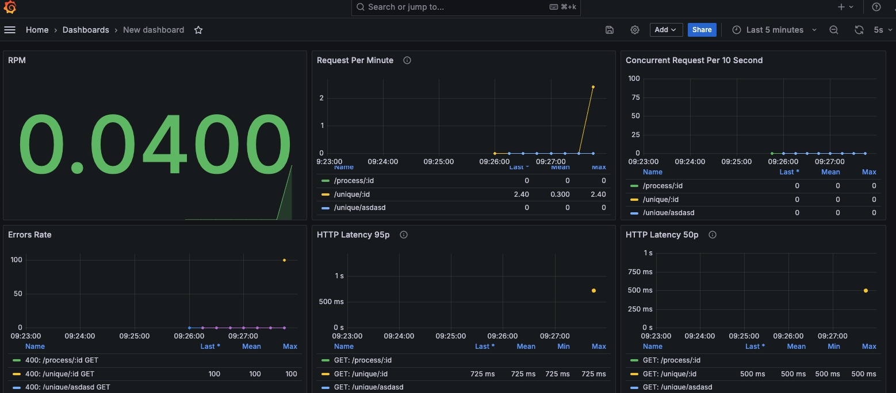
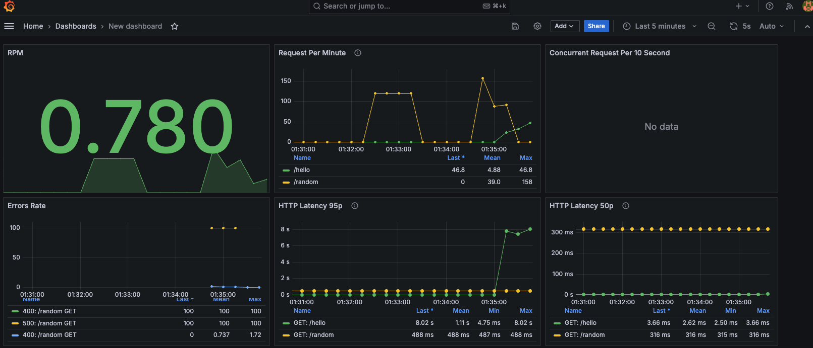

# FastAPI RED Metrics Project

This project demonstrates how to implement RED (Rate, Errors, Duration) metrics in a FastAPI application using Prometheus and Grafana.

## What are RED Metrics?

RED metrics are a set of metrics that provide a high-level overview of your service's performance:

- **Rate**: The number of requests per second.
- **Errors**: The number of failed requests per second.
- **Duration**: The amount of time each request takes.

### Benefits of RED Metrics

1. **Simplicity**: RED metrics provide a clear and concise view of your service's health.
2. **Universal applicability**: These metrics are relevant to almost any service or microservice.
3. **Quick problem detection**: Anomalies in any of these metrics can quickly point to issues in your service.
4. **Performance insights**: They help in understanding the service's performance characteristics over time.
5. **Capacity planning**: Rate metrics can be used to plan for scaling and capacity needs.

## Project Structure

- `fastapi-app/`: Contains the FastAPI application code.
- `monitoring/`: Contains configuration files for Prometheus and Grafana.
- `docker-compose.yml`: Defines and runs the multi-container Docker application.

## How to Run

1. Make sure you have Docker and Docker Compose installed.
2. Clone this repository.
3. Navigate to the project directory.
4. Run `docker-compose up --build`
5. Access the FastAPI application at `http://localhost:8000/docs`
6. Access Prometheus at `http://localhost:9090`
7. Access Grafana at `http://localhost:3000` (default credentials: admin/admin)
8. on Grafana you can import by using json file in `monitoring/grafana/dashboards/grafana_dashboard.json` to your grafana dashboard

## Monitoring

- Use Prometheus to scrape and store the metrics.
- Use Grafana to visualize the metrics with the provided dashboard template.

Enjoy monitoring your FastAPI application with RED metrics!

