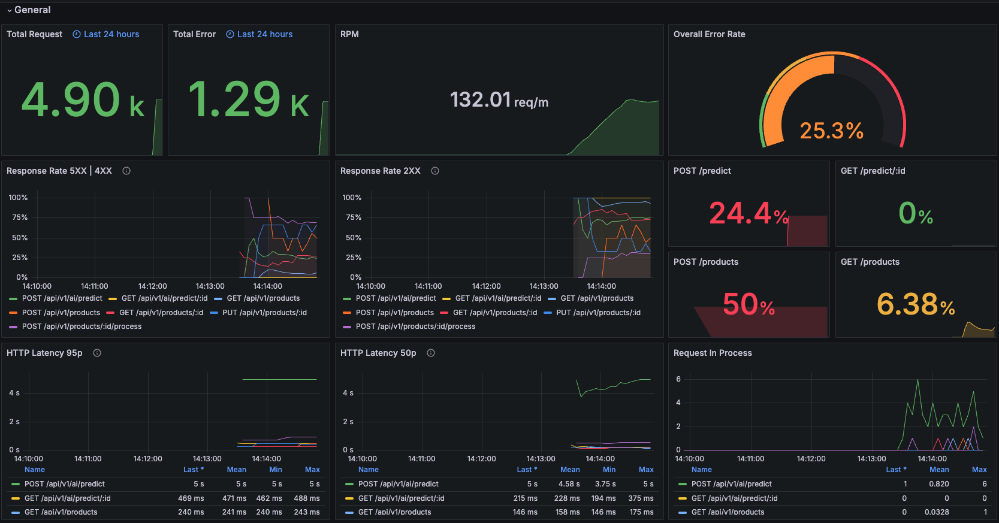
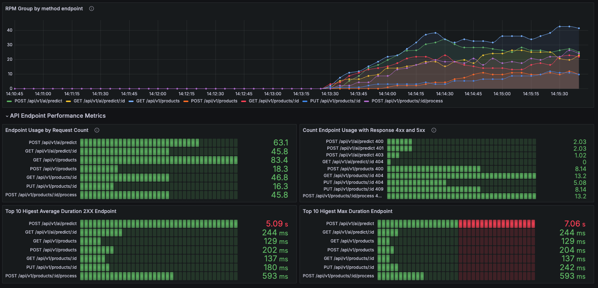
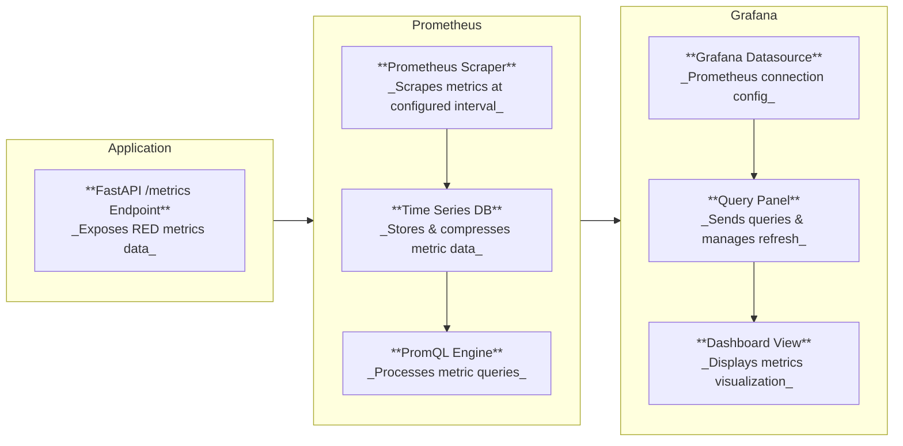

# FastAPI RED Metrics 

This project demonstrates how to implement RED (Rate, Errors, Duration) metrics in a FastAPI application using Prometheus and Grafana.






## ⚡ How to Run

1. Make sure you have Docker and Docker Compose installed.
2. Clone this repository.
3. Navigate to the project directory.
4. Run `make up`
5. Access the FastAPI application at [API Documentation http://localhost:18123/docs](http://localhost:18123/docs)
6. Access Prometheus at [http://localhost:9090](http://localhost:9090)
7. Access Grafana at [http://localhost:3000](http://localhost:9090) 
    - Login (default credentials: admin/admin)
    - Go to Dashboard , select `FastAPP RED Metrics Dashboard`

## How Run the Simulation

This project uses Locust for load testing (simulating real usage). When you run `make simulate`, Locust will:

- Start 10 users (virtual clients)
- Spawn rate of 1 user per second
- Target the API at http://localhost:18123
- Run in headless mode (without Web UI)

## How to Implement to Your Own FastAPI Application

1. **Install Dependencies**: Add the required dependencies to your `requirements.txt`
2. copy `metrics.py` to your FastAPI application
3. in `main.py`, import and include the metrics middleware
```python
...

from <your-path>.metrics import METRICS_COLLECTOR, expose_metrics_endpoint

...

# Add metrics endpoint
METRICS_COLLECTOR.init_app(app)
app.add_api_route(
    "/metrics",
    expose_metrics_endpoint,
    methods=["GET"],
    include_in_schema=False,
)

...
```

## 🤔 What are RED Metrics?

RED metrics are a set of metrics that provide a high-level overview of your service's performance:

- **Rate**: The number of requests per second.
- **Errors**: The number of failed requests per second.
- **Duration**: The amount of time each request takes.

### Benefits of RED Metrics

1. **Simplicity**: RED metrics provide a clear and concise view of your service's health.
2. **Universal applicability**: These metrics are relevant to almost any service or microservice.
3. **Quick problem detection**: Anomalies in any of these metrics can quickly point to issues in your service.
4. **Performance insights**: They help in understanding the service's performance characteristics over time.
5. **Capacity planning**: Rate metrics can be used to plan for scaling and capacity needs.

## 🗂️ Project Structure

- `fastapi-app/`: Contains the FastAPI application code.
- `monitoring/`: Contains configuration files for Prometheus and Grafana.
- `docker-compose.yml`: Defines and runs the multi-container Docker application.


## 📈 Monitoring



- Use Prometheus to scrape and store the metrics.
- Use Grafana to visualize the metrics with the provided dashboard template.

Enjoy monitoring your FastAPI application with RED metrics!


## References
- [fastapi-observability](https://github.com/blueswen/fastapi-observability?tab=readme-ov-file#quick-start)
- [Prometheus and Grafana](https://last9.io/blog/prometheus-and-grafana/)
- [The RED Method: How to Instrument Your Services](https://grafana.com/blog/2018/08/02/the-red-method-how-to-instrument-your-services/)