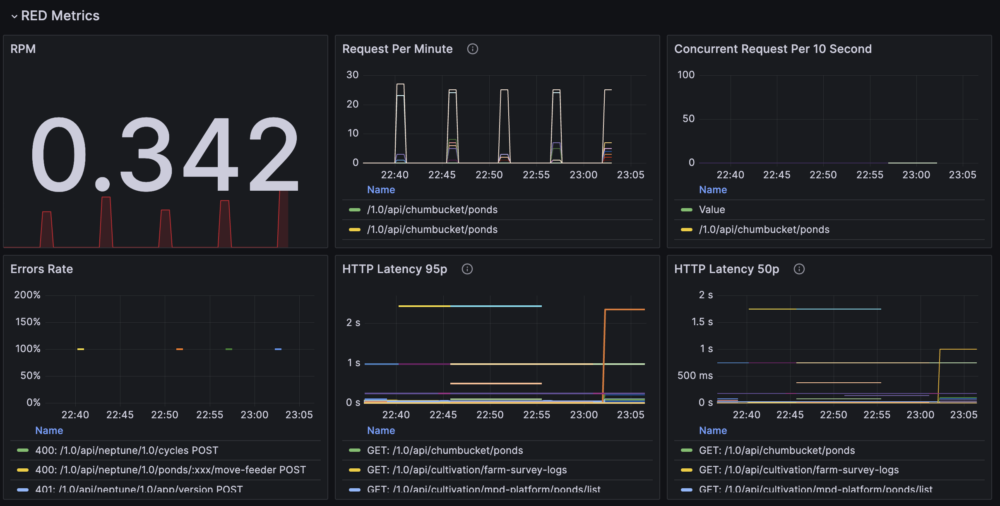

# RED Metrics for FastAPI

## Overview
The following queries are used to build RED (Rate, Errors, Duration) metrics for monitoring the performance of FastAPI services. These metrics provide insights into the health and efficiency of your service by tracking the request rate, error rate, and request duration. All these queries reference from Template Dashboard (in section RED metrics) Infra Team.



### 1. RPM (Requests Per Minute)
**Query:**
```prometheus
sum(rate(http_request_duration_seconds_count{pod=~"$deployment.*"}[1m]))
```

**Explanation:**

- **Purpose:** This query calculates the total number of HTTP requests per minute across all pods matching the `$deployment` pattern.

- **How it works:**
  - `http_request_duration_seconds_count` is the total count of requests.
  - `rate(...[1m])` calculates the per-second average rate of requests over the past minute.
  - `sum(...)` aggregates the rate across all matching pods.

**Reading the Panel:**

- The panel displays the total number of requests processed per minute, helping you understand the overall load on the service.

### 2. Request Per Minute (Grouped by Pod and Handler)
**Query:**
```prometheus
sum by (pod, handler) (increase(http_request_duration_seconds_count{pod=~"$deployment.*"}[1m]))
```

**Explanation:**

- **Purpose:** This query provides the number of requests per minute, broken down by pod and handler.

- **How it works:**

  - `increase(...[1m])` gives the total number of requests that have occurred in the last minute.
  - `sum by (pod, handler)` groups and sums the results by `pod` and `handler`.

**Reading the Panel:**

- The panel shows the request distribution across different pods and endpoints, helping identify specific areas with high traffic.

### 3. Concurrent Requests Per 10 Seconds
**Query:**
```prometheus
sum(rate(http_requests_inflight{pod=~"$deployment.*"}[10s])) by (handler)
```

**Explanation:**

- **Purpose:** This query measures the number of active (inflight) requests in the last 10 seconds, grouped by handler.

- **How it works:**
    - `http_requests_inflight` tracks the number of concurrent requests.
    - `rate(...[10s])` calculates the per-second rate over the last 10 seconds.
    - `sum by (handler)` groups the results by `handler`.

**Reading the Panel:**

- The panel indicates how many requests are being processed simultaneously, which is useful for detecting potential bottlenecks.

### 4. Errors Rate (Grouped by Status Code)
**Query for 4xx Errors:**
```prometheus
(sum(rate(http_request_duration_seconds_count{pod=~"$deployment.*", code=~"4.."}[1m])) by (code, handler, method, pod)) / (sum(rate(http_request_duration_seconds_count[1m])) by (code, handler, method, pod)) * 100
```

**Query for 5xx Errors:**
```prometheus
(sum(rate(http_request_duration_seconds_count{pod=~"$deployment.*", code=~"5.."}[1m])) by (code, handler, method, pod)) / (sum(rate(http_request_duration_seconds_count[1m])) by (code, handler, method, pod)) * 100
```

**Explanation:**

- **Purpose:** These queries calculate the error rate for 4xx and 5xx HTTP status codes as a percentage of total requests.

- **How it works:**

  - `rate(...[1m])` determines the rate of requests with 4xx or 5xx status codes.
  - The rate is divided by the total rate of requests, and the result is multiplied by 100 to get a percentage.

**Reading the Panel:**

- The panel shows the percentage of requests that resulted in client or server errors, helping you monitor and react to errors in real-time.

### 5. HTTP Latency 95th Percentile (p95)
**Query:**
```prometheus
histogram_quantile(
    0.95,
    sum by (handler, method, le) (rate(http_request_duration_seconds_bucket{pod=~"$deployment.*"}[10m]))
)
```

**Explanation:**

- **Purpose:** This query measures the 95th percentile latency for HTTP requests.

- **How it works:**

  - `http_request_duration_seconds_bucket` contains the observed durations of requests.
  - `rate(...[10m])` calculates the rate of requests over the past 10 minutes.
  - `histogram_quantile(0.95, ...)` computes the 95th percentile latency.

**Reading the Panel:**

- The panel shows the response time under which 95% of requests are completed, providing insight into the tail latency of the service.

### 6. HTTP Latency 50th Percentile (p50)
**Query:**
```prometheus
histogram_quantile(
    0.50,
    sum by (handler, method, le) (rate(http_request_duration_seconds_bucket{pod=~"$deployment.*"}[10m]))
)
```

**Explanation:**

- **Purpose:** This query calculates the 50th percentile (median) latency for HTTP requests.

- **How it works:**

  - The method is the same as for p95, but with `histogram_quantile(0.50, ...)` to get the median latency.

**Reading the Panel:**

- The panel displays the median response time, representing the latency experienced by the average request.
